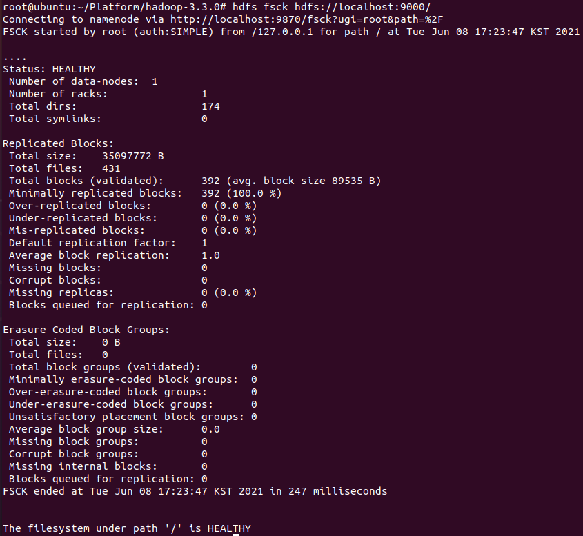
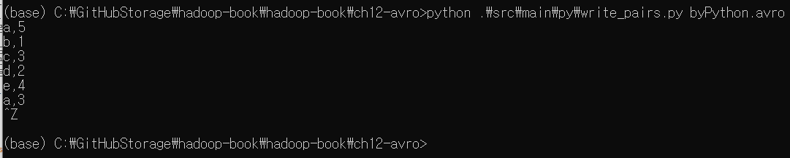
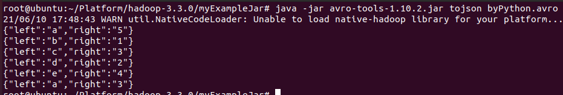

# Hadoop-The-Definitive-Guide
Hadoop Configuration, Hadoop Management and Hadoop Ecosystem (Summary of content in the Hadoop The Definitive Guide)

## Contents
1. [Using](#using)
2. [Hadoop Configuration](#hadoop-configuration)
3. [Hadoop Management Tools](#hadoop-management-tools)
4. [Hadoop Monitoring](#hadoop-monitoring)
5. [Hadoop Maintenance](#hadoop-maintenance)
6. [Avro](#avro)

----------------------------------------------------------------

## Using
1. **OS** - Ubuntu 20.04.1 LTS (VMware)
2. **BackEnd** - **Hadoop(v3.3.0)**, Python (3.9.2), Java (JDK 1.8)
3. **IDE** - Visual Studio Code, IntelliJ
4. **etc** - Avro tools (1.10.2)

----------------------------------------------------------------

## Hadoop Configuration
1. Hadoop Configuration File (하둡 기본 디렉터리 아래의 etc/hadoop/디렉터리 에 존재)
    1. hadoop-env.sh (Bash 스크립트)
        - 하둡을 구성하는 스크립트에서 사용되는 환경변수
    2. mapred-env.sh (Bash 스크립트)
        - 맵리듀스를 구동하는 스크립트에서 사용되는 환경변수 (hadoop-env.sh에서 재정의)
    3. yarn-env.sh (Bash 스크립트)
        - YARN을 구도하는 스크립트에서 사용되는 환경변수 (hadoop-env.sh에서 재정의)
    4. core-site.xml (하둡 설정 XML)
        - HDFS, 맵리듀스, YARN에서 공통적으로 사용되는 I/O 설정과 같은 하둡 코어를 위한 환경 설정 구성
    5. hdfs-site.xml (하둡 설정 XML)
        - 네임노드, 보조 네임노드, 데이터노드 등과 같은 HDFS 데몬을 위한 환경 설정 구성
    6. mapred-site.xml (하둡 설정 XML)
        - 잡 히스토리 서버 같은 맵리듀스 데몬을 위한 환경 설정 구성
    7. yarn-site.xml (하둡 설정 XML)
        - 리소스 매니저, 웹 애플리케이션 프록시 서버, 노드 매니저와 같은 YARN 데몬을 위한 환경 설정 구성
    8. slaves (일반 텍스트)
        - 데이터노드와 노드 매니저를 구동할 컴퓨터의 목록 (행당 하나)
    9. hadoop-metrics2.properties (자바 속성)
        - 메트릭의 표시를 제어하기 위한 속성
    10. log4j.properties (자바 속성)
        - 시스템 로그, 네임노드 감사 로그, JVM 프로세스의 작업 로그
    11. hadoop-policy.xml (하둡 설정 XML)
        - 하둡을 보안 모드로 구동할 때 사용되는 접근제어 목록에 대한 환경 설정 구성
2. Basic configuration
    1. core-site.xml [Default](https://hadoop.apache.org/docs/r3.3.0/hadoop-project-dist/hadoop-common/core-default.xml)
        ```xml
        <?xml version="1.0"?>
        <configuration>
                <property>
                        <name>fs.defaultFS</name>
                        <value>hdfs://namenode/</value>
                </property>
        </configuration>
        ```
    2. hdfs-site.xml [Default](https://hadoop.apache.org/docs/r3.3.0/hadoop-project-dist/hadoop-hdfs/hdfs-default.xml)
        ```xml
        <?xml version="1.0"?>
        <configuration>
                <property>
                        <name>dfs.namenode.name.dir</name>
                        <value>/disk1/hdfs/name,/remote/hdfs/name</value>
                </property>
                <property>
                        <name>dfs.datanode.data.dir</name>
                        <value>/disk1/hdfs/data,/disk2/hdfs/data</value>
                </property>
                <property>
                        <name>dfs.namenode.checkpoint.dir</name>
                        <value>/disk1/hdfs/namesecondary,/disk2/hdfs/namesecondary</value>
                </property>
        </configuration>
        ```
    3. yarn-site.xml [Default](https://hadoop.apache.org/docs/r3.3.0/hadoop-yarn/hadoop-yarn-common/yarn-default.xml)
        ```xml
        <?xml version="1.0"?>
        <configuration>
                <property>
                        <name>yarn.resourcemanager.hostname</name>
                        <value>resourcemanager</value>
                </property>
                <property>
                        <name>yarn.nodemanager.local-dirs</name>
                        <value>/disk1/nm-local-dir,/disk2/nm-local-dir</value>
                </property>
                <property>
                        <name>yarn.nodemanager.aux-services</name>
                        <value>mapreduce.shuffle</value>
                </property>
                <property>
                        <name>yarn.nodemanager.resource.cpu-vcores</name>
                        <value>16</value>
                </property>
        </configuration>
        ```
    4. hdfs-rbf-site.xml [Default](https://hadoop.apache.org/docs/r3.3.0/hadoop-project-dist/hadoop-hdfs-rbf/hdfs-rbf-default.xml)
    5. mapred-site.xml [Default](https://hadoop.apache.org/docs/r3.3.0/hadoop-mapreduce-client/hadoop-mapreduce-client-core/mapred-default.xml)
3. 주요 HDFS 데몬 속성 (core-site.xml, hdfs-site.xml 에서 설정)
    1. fs.defaultFS
        - URI, 기본값 file:///
        - 기본 파일시스템. URI는 호스트명과 네임노드의 RPC 서버가 실행되는 포트 번호를 정의한다. 기본 포트 번호는 8020이다.
    2. dfs.namenode.name.dir
        - 콤마로 구분된 디렉터리 이름, 기본값 file://${hadoop.tmp.dir}/dfs/name
        - 네임노드가 영속적인 메타데이터를 저장할 디렉터리 목록을 지정한다. 네임노드는 메타데이터의 복제본을 목록에 디렉터리별로 저장한다.
    3. dfs.datanode.data.dir
        - 콤마로 구분된 디렉터리 이름, 기본값 file://${hadoop.tmp.dir}/dfs/data
        - 데이터노드가 블록을 저장할 디렉터리 목록. 각 블록은 이 디렉터리 중 오직 한 곳에만 저장된다.
    4. dfs.namenode.checkpoint.dir
        - 콤마로 구분된 디렉터리 이름, 기본값 file://${hadoop.tmp.dir}/dfs/namesecondary
        - 보조 네임노드가 체크포인트를 저장하는 디렉터리 목록. 목록에 있는 각 디렉터리에 체크포인트의 복제본을 저장한다.
    5. hadoop.tmp.dir
        - HDFS의 저장 디렉터리는 별도로 지정하지 않으면 하둡의 임시 디렉터리 하위에 위치한다.
        - hadoop.tmp.dir 속성으로 지정하며 기본값은 /tmp/hadoop-${user.name}
4. 주요 YARN 데몬 속성 (yarn-site.xml 에서 설정)
    1. yarn.resourcemanager.hostname
        - 호스트명, 기본값 0.0.0.0
        - 리소스 매니저가 수행된 머신의 호스트명. 아래에 ${y.rm.hostname} 축약형으로 표기
    2. yarn.resourcemanager.address
        - 호스트명과 포트, 기본값 ${y.rm.hostname}:8032
        - 리소스 매니저의 RPC 서버가 동작하는 호스트명과 포트
    3. yarn.nodemanager.local-dirs
        - 콤마로 구분된 디렉터리명, 기본값 ${hadoop.tmp.dir}/nm-local-dir
        - 컨테이너가 임시데이터를 저장하도록 노드매니저가 정한 디렉터리 목록. 애플리케이션이 종료되면 데이터가 지워진다.
    4. yarn.nodemanager.aux-services
        - 콤마로 구분된 서비스명
        - 노드 매니저가 수행하는 보조 서비스 목록. 서비스는 yarn.nodemanager.aux-services.service-name.class 속성으로 정의된 클래스로 구현된다. 기본적으로 보조 서비스는 지정되지 않는다.
    5. yarn.nodemanager.resource.memory-mb
        - int, 기본값 8192
        - 노드 매니저가 수행할 컨테이너에 할당되는 물리 메모리양(MB 단위)
    6. yarn.nodemanager.vmem-pmem-ratio
        - float, 기본값 2.1
        - 컨테이너에 대한 가상/물리 메모리 비율. 가상 메모리 사용량은 이 비율에 따라 초과 할당될 수 있다.
    7. yarn.nodemanager.resource.cpu-vcores
        - int, 기본값 8
        - 노드 매니저가 컨테이너에 할당할 수 있는 CPU 코어의 수
5. 맵리듀스 잡의 메모리 속성 (클라이언트에서 설정)
    1. mapreduce.map.memory.mb
        - int, 기본값 1024
        - 맵 컨테이너의 메모리 총량
    2. mapreduce.reduce.memory.mb
        - int, 기본값 1024
        - 리듀스 컨테이너의 메모리 총량
    3. mapreduce.child.java.opts
        - String, 기본값 -Xmx200m
        - 맵과 리듀스 태스크를 실행하는 컨테이너 프로세스를 시작하는 데 사용되는 JVM 옵션. 이 속성은 메모리 설정 외에도 디버깅 목적의 JVM 속성을 포함할 수 있다.
    4. mapreduce.map.java.opts
        - String, 기본값 -Xmx200m
        - 맵 테스크를 실행하는 자식 프로세스에서 사용되는 JVM 옵션
    5. mapreduce.reduce.java.opts
        - String, 기본값 -Xmx200m
        - 리듀스 테스크를 실행하는 자식 프로세스에서 사용되는 JVM 옵션
6. 맵 측면에서 튜닝 속성
    1. mapreduce.task.io.sort.mb
        - int, 기본값 100
        - 맵 출력을 정렬하는 동안 사용할 메모리 버퍼의 크기로, 메가바이트 단위
    2. mapreduce.map.sort.spill.percent
        - float, 기본값 0.80
        - 디스크로의 스필을 시작하기 위한 맵 출력 메모리 버퍼와 레코드 경계 인덱스의 한계 사용 비율
    3. mapreduce.task.io.sort.factor
        - int, 기본값 10
        - 파일 정렬 시 한번에 병합할 스트림의 최대 수. 이 속성은 리듀스에서도 사용된다. 100으로 증가시키는 것이 꽤 일반적이다.
    4. mapreduce.map.combine.minspills
        - int, 기본값 3
        - 컴바이너를 실행하기 위해 필요한 스필 파일의 최소 수 (컴바이너가 명시되어 있을 때)
    5. mapreduce.map.output.compress
        - boolean, 기본값 false
        - 맵 출력 압축 여부
    6. mapreduce.map.output.compress.codec
        - Class, 기본값 org.apache.hadoop.io.compress.DefaultCodec
        - 맵 출력에 사용할 압축 코덱
    7. mapreduce.shuffle.max.threads
        - int, 기본값 0
        - 맵 출력을 리듀서에 제공하기 위한 노드 매니저별 워커 스레드 수. 클러스터 전체 설정이며 개별 잡에 설정이 불가능하다. 0은 네티 (Netty) 기본값인 가용 프로세서 수의 두 배다.
7. 리듀스 측면에서 튜닝 속성
    1. mapreduce.reduce.shuffle.parallelcopies
        - int, 기본값 5
        - 맵 출력을 리듀서에 복사하기 위해 사용되는 스레드 수
    2. mapreduce.reduce.shuffle.maxfetchfailures
        - int, 기본값 10
        - 리듀서가 에러를 보고하기 전에 수해하는 맵 출력 인출 시도 수
    3. mapreduce.task.io.sort.factor
        - int, 기본값 10
        - 파일을 정렬할 때 한번에 병합하는 스트림의 최대 수. 이 속성은 맵에서도 사용된다.
    4. mapreduce.reduce.shuffle.input.buffer.percent
        - float, 기본값 0.70
        - 셔플의 복사 단계 동안 맵 출력 버퍼에 할당되는 전체 힙 크기 비율
    5. mapreduce.reduce.shuffle.merge.percent
        - float, 기본값 0.66
        - 출력의 병합과 디스크에 스필을 시작하기 위한 맵 출력 버퍼의 한계 사용 비율
    6. mapreduce.reduce.merge.inmem.threshold0
        - int, 기본값 1000
        - 출력의 병합과 디스크에 스필하는 과정을 시작하기 위한 맵 출력의 한계 수. 0 이하의 값은 한계가 없다는 의미며, 스필 동작은 mapreduce.reduce.shuffle.merge.percent에 의해 결정된다.
    7. mapreduce.reduce.input.buffer.percent
        - float, 기본값 0.0
        - 리듀서가 진행되는 동안 맵 출력을 메모리에 유지하는 데 사용되는 전체 힙 크기의 비율. 리듀스 단계가 시작되면 메모리의 맵 출력 크기는 이 크기를 넘을 수 없다. 기본적으로 리듀스에 가능한 한 많은 메모리를 할당하기 위해 리듀스를 시작하기 전에 모든 맵 출력을 디스크에 병합해놓는다. 하지만 리듀서가 요구하는 메모리가 적다면 디스크 IO를 최소화하기 위해 이 값은 증가될 수 있다.
8. RPC 서버 속성
    1. fs.default.FS
        - 기본값 file:///
        - HDFS URI 설정 시 이 속성은 네임노드의 RPC 서버의 주소와 포트를 정의한다. 지정하지 않으면 기본 포트는 8020이다.
    2. dfs.namenode.rpc-bind-host
        - 네임노드의 RPC 서버가 바인드할 주소. 설정하지 않으면 바인드 주소는 fs.defaultFS 속성의 값으로 정의된다. 0.0.0.0 으로 설정하면 네임노드가 모든 인터페이스에 대해 대기하도록 할 수 있다.
    3. dfs.datanode.ipc.address
        - 기본값 0.0.0.0:50020
        - 데이터노드의 RPC 서버 주소와 포트
    4. mapreduce.jobhistory.address
        - 기본값 0.0.0.0:10020
        - 잡 히스토리 서버의 RPC 서버 주소와 포트. 이 속성은 클라이언트 (일반적으로 클러스터 외부)가 잡 히스토리를 쿼리하기 위해 사용한다.
    5. mapreduce.jobhistory.bind-host
        - 잡 히스토리 서버의 RPC와 HTTP 서버가 바인드할 주소
    6. yarn.resourcemanager.hostname
        - 기본값 0.0.0.0
        - 리소스 매니저가 수행될 머신의 호스트명. 아래에 ${y.rm.hostname} 축약형으로 표기
    7. yarn.resourcemanager.bind-host
        - 리소스 매니저의 RPC와 HTTP 서버가 바인드하는 주소
    8. yarn.resourcemanager.address
        - 기본값 ${y.rm.hostname}:8032
        - 리소스 매니저의 RPC 서버 주소와 포트. 이 속성은 클라이언트 (일반적으로 클러스터 외부)가 리소스 매니저와 통신하기 위해 사용한다.
    9. yarn.resourcemanager.admin.address
        - 기본값 ${y.rm.hostname}:8033
        - 리소스 매니저의 admin RPC 서버 주소와 포트. admin 클라이언트 (일반적으로 클러스터 외부에서 yarnadmin으로 수행)가 리소스 매니저와 통신하기 위해 사용한다.
    10. yarn.resourcemanager.scheduler.address
        - 기본값 ${y.rm.hostname}:8030
        - 리소스 매니저 스케줄러의 RPC 서버의 주소와 포트. 이 속성은 클러스터 내 애플리케이션 마스터가 리소스 매니저와 통신하기 위해 사용한다.
    11. yarn.resourcemanager.resource-tracker.address
        - 기본값 ${y.rm.hostname}:8031
        - 리소스 매니저 리소스 트래커의 RPC 서버 주소 및 포트. 이 속성은 클러스터 내 노드 매너지가 리소스 매니저와 통신하기 위해 사용한다.
    12. yarn.nodemanager.hostname
        - 기본값 0.0.0.0
        - 노드 매니저가 수행되는 머신의 호스트명. 아래에 ${y.nm.hostname} 축약형으로 표기
    13. yarn.nodemanager.bind-host
        - 노드 매너지의 RPC와 HTTP 서버가 바인드할 주소
    14. yarn.nodemanager.address
        - 기본값 ${y.nm.hostname}:0
        - 노드 매너지의 RPC 서버 주소와 포트. 이 속성은 클러스터 내 애플리케이션 마스터가 노드 매너지와 통신하기 위해 사용한다.
    15. yarn.nodemanager.localizer.address
        - 기본값 ${y.nm.hostname}:8040
        - 노드 매니저 로컬라이저의 RPC 서버 주소와 포트
9. HTTP 서버 속성
    1. dfs.namenode.http-address
        - 기본값 0.0.0.0:50070
        - 네임노드의 HTTP 서버 주소와 포트
    2. dfs.namenode.http-bind-host
        - 네임노드의 HTTP 서버가 바인드할 주소
    3. dfs.namenode.secondary.http-address
        - 기본값 0.0.0.0:50090
        - 보조 네임노드의 HTTP 서버 주소와 포트
    4. dfs.datanode.http.address
        - 기본값 0.0.0.0:50075
        - 데이터노드의 HTTP 서버 주소와 포트.
    5. mapreduce.jobhistory.webapp.address
        - 기본값 0.0.0.0:19888
        - 맵리듀스 잡 히스토리 서버의 주소와 포트. 이 속성은 mapred-site.xml에서 설정한다.
    6. mapreduce.shuffle.port
        - 기본값  13562
        - 셔플 핸들러의 HTTP 포트 번호. 이 속성은 맵 출력을 처리하는 데 사용되며 웹 UI로 사용자가 접근할 수 없다. 이 속성은 mapred-site.xml에서 설정한다.
    7. yarn.resourcemanager.webapp.address
        - 기본값 ${y.rm.hostname}:8088
        - 리소스 매니저의 HTTP 서버 주소 및 포트
    8. yarn.nodemanager.webapp.address
        - 기본값 ${y.nm.hostname}:8042
        - 노드 매니저의 HTTP 서버 주소 및 포트
    9. yarn.web-proxy.address
        - 웹 애플리케이션 프록시 서버의 HTTP 서버 주소와 포트. 설정하지 않으면 기본으로 웹 애플리케이션 프록시 서버가 리소스 매니저 프로세스 내에서 수행된다.
        
---------------------------------------------------------------

## Hadoop Management Tools
1. dfsadmin
    - HDFS의 상태 정보를 확인하고 HDFS에서 다양한 관리 작업을 수행할 수 있는 다목적 도구
    - 슈퍼유저 권한이 필요하며, hdfs dfsadmin 명령으로 실행
    - dfsadmin 명령
        1. -help : 입력받은 명령어에 대한 도움말을 보여준다. 명령어를 지정하지 않으면 모든 명령어를 표시한다.
        2. -report : 파일시스템 통계 (웹 UI와 유사)와 연결된 데이터노드 정보를 보여준다.
        3. -metasave : 연결된 데이터노드 리스트와 복제되거나 삭제된 블록 정보를 하둡 로그 디렉터리 내에 파일로 저장한다.
        4. -savemode : 안전 모드의 상태를 변경하거나 조회한다.
        5. -saveNameSpace : 현재 메모리상에 있는 파일시스템 이미지를 새로운 fsimage 파일에 저장하고 edits 파일을 초기화한다. 이 동작은 안전 모드에서만 수행 가능하다.
        6. -fetchImage : 네임노드에서 가장 최신의 fsimage를 찾아 로컬 파일로 저장한다.
        7. -refreshNodes : 네임노드에 접속이 허가된 데이터노드 집합을 갱신한다.
        8. -upgradeProgress : HDFS 업그레이드 진행에 대한 정보를 가져오거나 업그레이드를 강제로 진행한다.
        9. -finalizeUpgrade : 이전 버전의 네임노드와 데이터노드 저장 디렉터리를 제거한다. 업그레이드가 적용되고 새로운 버전으로 클러스터가 성공적으로 실행된 후에 사용할 수 있다.
        10. -setQuota : 디렉터리 할당량을 설정한다. 디렉터리 할당량은 디렉터리 트리 내의 파일과 디렉터리 이름의 개수를 제한한다. 디렉터리 할당량은 사용자가 많은 수의 작은 파일을 생성하는 것을 방지하는 데 유용하며, 네임노드의 메로리를 유지하는 데 도움이 된다.
        11. -clrQuota : 저장된 디렉터리 할당량을 지운다.
        12. -setSpaceQuota : 디렉터리에 용량기준 할당량을 설정한다. 이는 디렉터리 트리 내에 저장할 수 있는 파일의 크기를 제한한다. 사용자에게 제한된 용량의 저장 공간을 제공하는 데 유용하다.
        13. -clrSpaceQuota : 디렉터리에 지정된 용량기준 할당량을 지운다.
        14. -refreshServiceAcl : 네임노드의 서비스 수준 인가 정책 파일을 갱신한다.
        15. -allowSnapshot : 지정된 디렉터리에 스냅숏을 생성하는 것을 허락한다.
        16. -disallowSnapshot : 지정된 디렉터리에 스냅숏을 생성하는 것을 불허한다.
2. fsck
    - HDFS에 저장된 파일의 상태 점검을 위한 유틸리티
    - 적게 혹은 많이 복제된 블록뿐만 아니라 모든 데이터노드에서 사라진 블록을 찾을 수 있다.
    - 입력받은 경로를 시작으로 파일시스템 네임스페이스를 재귀적으로 순회하면서 찾은 파일들을 점검한다.
    - 실행 명령어
        ```bash
        % hdfs fsck <fs path>
        ```
        <p align="center">
            
        </p>
    - 확인 해야할 상태
        1. 초과 복제 블록 (Over-replicated-blocks) : 이는 파일을 구성하는 블록 중에서 목표 복제 개수를 초과하는 블록이다. 일반적으로 초과 복제는 문제가 되지 않는다. 그리고 HDFS는 초과 블록 복제본을 자동으로 삭제한다.
        2. 복제 기준 미만의 블록 (Under-replicated-blocks) : 이는 파일을 구성하는 블록 중에서 목표 복제 개수에 미치지 못하는 블록으로, HDFS는 목표 복제 개수가 될 때까지 복제 기준에 미달하는 블록의 새로운 복제본을 자동으로 생성한다. hdfs dfsadmin -metasave 명령을 이용하면 복제가 되고 있거나 대기 상태에 있는 블록 정보를 확인할 수 있다.
        3. 잘못 복제된 블록 (Mis-replicated-blocks) : 이는 블록 복제 배치 정책을 만족하지 않는 블록이다. 예를 들어 복제 수준이 3인 멀티랙 클러스터에서 3개의 복제본 모두가 동일한 랙에 있다면 해당 블록은 잘못 복제된 블록이 된다. 복제본이 장애 복구 능력을 갖기 위해서는 최소 2개의 랙에 분산되어 있어야 한다. HDFS는 잘못 복제된 블록을 자동으로 다시 복제하여 랙 배치 정책을 준수하게 만든다.
        4. 손상된 블록 (Corrupt blocks) : 모든 복제본을 사용할 수 없으면 손상된 블록이다. 적어도 한 개의 정상적인 복제본을 가진 블록은 손상된 것으로 보고되지 않는다. 네임노드는 손상되지 않은 블록을 목표 복제 개수에 도달할 때까지 복제한다.
        5. 누락된 복제본 (Missing replicas) : 누락된 블록은 클러스터 어디에서도 복제본을 찾을 수 없는 블록이다.
3. block scanner
    - 모든 데이터노드는 블록 스캐너를 실행하여 데이터노드에 저장된 모든 블록을 주기적으로 점검한다. 이를 통해 클라이언트가 블록을 읽기 전에 문제가 있는 블록을 탐지하고 수리할 수 있다. 블록 스캐너는 점검할 블록의 목록을 관리하며 체크섬 오류를 찾기 위해 모든 블록을 확인한다. 스캐너는 데이터노드의 디스크 대역폭을 유지하기 위한 조절 메커니즘을 사용한다.
    - 시간이 지남에 따라 발생하는 디스크 오류에 대처하기 위해 3주마다 전체 블록을 점검한다. 검사 주기는 dfs.datanode.scan.period.hours 속성으로 설정하며, 기본값은 504시간이다. 손상된 블록이 있으면 네임노드에 보고한다.
    - 데이터노드의 웹 인터페이스인 http://datanode:50075/blockScannerReport를 방문하면 블록 점검 보고서를 얻을 수 있다.
4. balancer
    - 시간이 지남에 따라 데이터노드 사이의 블록의 분포는 불균형 상태가 될 수 있다. 불균형 상태의 클러스터는 맵리듀스의 지역성에 영향을 받게 되므로 자주 사용되는 데이터노드에 큰 부하를 주게 된다. 따라서 불균현 상태가 되지 않도록 해야 한다.
    - 밸런서 프로그램은 블록을 재분배하기 위해 사용률이 높은 데이터노드의 블록을 사용률이 낮은 데이터노드로 옮기는 하둡 데몬이다. 블록 복제본을 다른 랙에 두어서 데이터 유실을 방지하는 블록 복제본 배치 정책은 그대로 고수한다. 밸런서는 클러스터가 균형 상태가 될 때까지 블록을 이동시킨다. 여기서 균형 상태란 각 데이터노드의 사용률 (노드의 총 가용 공간과 사용된 공간의 비율)이 클러스터의 사용률 (클러스터의 총 가용 공간과 사용된 공간의 비율)과 비교하여 지정된 임계치 비율 이내일 때를 의미한다.
    - 실행 명령어
        ```bash
        % start-balancer.sh
        ```
    - -threshold 인자에는 클러스터의 균형 상태를 의미하는 임계치 비율을 지정한다. 이 플래그는 선택사항이며, 지정하지 않으면 임계치는 10%다. 클러스터에는 오직 하나의 밸런서만 실행될 수 있다.
    
---------------------------------------------------------------

## Hadoop Monitoring
1. 로깅
    1. 로그 수준 설정
        - 하둡 데몬은 log4j 로그파일 (각 데몬의 웹 UI의 /logLevel에서 찾을 수 있다)의 로그 수준을 변경할 수 있는 웹 페이지를 제공한다. 일반적으로 하둡의 로그파일의 이름은 로깅을 수행하는 클래스명과 관련이 있지만 예외도 있다. 따라서 로그파일의 이름을 알기 위해서는 소스 코드를 직접 확인해야 한다.
        - 특정 접미사로 시작하는 모든 패키지는 로깅을 활성화시킬 수 있다. 예를 들어 리소스 매니저와 관련된 모든 클래스의 디버그 로깅을 활성화하려면 http://resource-manager-host:8088/logLevel 에 접속해서 로그파일 이름 org.apache.hadoop.yarn.server.resourcemanager 를 DEBUG 수준으로 설정하면 된다.
        - 다음 명령으로 동일한 작업을 수행할 수 있다.
            ```bash
            % hadoop daemonlog -setlevel resource-manager-host:8088 org.apache.hadoop.yarn.server.resourcemanager DEBUG
            ````
        - 이런 방식으로 변경된 로그 수준은 데몬을 다시 시작할 때 재설정된다. 이는 일반적으로 선호하는 방식이다. 하지만 변경된 로그 수준을 지속적으로 유지하고 싶으면 환경 설정 디렉터리에 있는 log4j.properties 파일을 변경해야 한다. 다음과 같이 한 행을 추가한다.
            ```bash
            log4j.logger.org.apache.hadoop.yarn.server.resourcemanager=DEBUG
            ```
    2. 스택 트레이스 얻기
        - 하둡 데몬은 JVM에서 실행되는 모든 스레드에 대해 덤프를 생성할 수 있는 웹 페이지 (웹 UI의 /stacks) 를 제공한다. 예를 들어 리소스 매니저의 스레드 덤프를 http://resource-manager-host:8088/stacks 에서 얻을 수 있다.
2. 메트릭과 JMX
    1. 메트릭
        - 하둡 데몬은 메트릭 (metric) 으로 알려진 이벤트와 측정치에 대한 정보를 수집한다. 예를 들면 데이터노드는 기록된 바이트 수, 복제된 블록 수, 클라이언트의 읽기 요청 수 등의 메트릭을 수집한다.
        - 메트릭은 dfs, mapred, yarn, rpc 등 여러 콘텍스트에 속해 있다. 하둡 데몬은 보통 여러 콘텍스트에 있는 메트릭을 수집한다. 예를 들어 데이터노드는 dfs와 rpc 콘텍스트에서 메트릭을 수집한다.
    2. 메트릭과 카운터의 차이점
        - 메트릭과 카운터의 가장 큰 차이점은 수집하는 정보의 범위다. 메트릭은 하둡 데몬이 수집하지만 카운터는 맵리듀스 태스크가 수집하고 전체 잡을 위해 집계된다. 또한 서비스의 대상도 다른데, 메틕은 관리자, 카운터는 맵리듀스 사용자를 위해 정보를 수집한다.
        - 그리고 수집되고 집계되는 방식도 서로 다르다. 카운터는 맵리듀스의 기능이다. 맵리듀스 시스템은 태스크 JVM에서 생성된 카운터의 값을 애플리케이션 마스터로 전달하고 최종적으로 맵리듀스 잡을 실행한 클라이언트로 전달되는 것을 보장한다. 태스크 프로세스와 애플리케이션 마스터 둘 다 집계 작업을 수행한다.
        - 메트릭의 수집 메커니즘은 갱신된 결과를 전달받는 컴포넌트와 분리되어 있다. 로컬 파일, 갱글리아 (Ganglia), JMX 등 다양한 방식으로 결과를 얻을 수 있다. 메트릭을 수집하는 데몬은 결과를 보내기 전에 집계 작업을 수행한다.
    3. JMX
        - 모든 하둡 메트릭은 JMX (Java Management Extension)로 게재되기 때문에 JDK에 포함된 JConsole과 같은 표준 JMX 도구를 사용해서 메트릭을 볼 수 있다. 원격 모니터링을 하기 위해서는 외부 접속을 허용하는 JMX 시스템 속성인 com.sum.management.jmxremote.port (그리고 다른 보안 속성)를 적절히 설정해야 한다. 네임노드를 원격 모니터링하기 위해서는 다음과 같이 hadoop-env.sh에 설정하면 된다.
            ```bash
            HADOOP_NAMENODE_OPTS="-Dcom.sun.management.jmxremote.port=8004"
            ```
        - 하둡 데몬의 /jmx 웹 페이지에 접소갛면 해당 데몬이 수집한 JSON 형식으로 된 JMX 메트릭을 직접 볼 수 있다. 이 방식을 활용하면 디버깅을 쉽게 할 수 있다. 예를 들어 http://namenode-host:50070/jmx 에 접속하면 네임노드의 메트릭 정보를 볼 수 있다.
        - 하둡은 로컬 파일이나 갱글리아 모니터링 시스템과 같은 외부 시스템에 메트릭 정보를 게재하기 위해 다양한 메트릭 싱크 (sink) 기능을 제공한다. 싱크 기능은 hadoop-metrics2.properties 파일에서 설정하며, 이 파일에는 설정 예제도 들어 있다.
        
---------------------------------------------------------------

## Hadoop Maintenance
1. 일상적인 관리 절차
    1. 메타데이터 백업
        - 네임노드의 영속적인 메타데이터가 손실되거나 훼손되면 전체 파일시스템을 사용할 수 없게 된다. 따라서 이러한 파일을 백업하는 것은 매우 중요하다. 네임노드에서 현재 작업 중인 파일이나 복사본의 손상을 방지하기 위해서는 서로 다른 시간대별 (한 시간, 하루, 한 주, 한 달 등)러 다수의 복사본을 보관하는 것이 좋다.
        - 백업을 하는 간단한 방법은 dfsadmin 명렁어를 사용하여 네임노드의 최신 fsimage의 복사본을 내려받는 것이다.
            ```bash
            % hdfs dfsadmin -fetchImage fsimage.backup
            ```
        - fsimage의 아카이브 사본을 저장하기 위해 원격에서 이 명령을 실행하는 스크립트를 작성할 수 있다. 이 스크립트는 반드시 복사본의 정합성을 추가로 검증해야 한다. 로컬 네임노드 데몬을 시작하고 fsimage와 edits 파일을 읽어 메모리에 성공적으로 입력한 것을 확인하는 방법으로 정확성을 검증할 수 있다. 예를 들어 네임노드의 로그에 적절한 성공 메시지가 있는지 찾아보면 된다.
    2. 데이터 백업
        - HDFS는 데이터를 안전하게 저장하도록 설계되었지만 다른 저장소 시스템처럼 데이터 손실이 발생할 가능성이 있다. 따라서 백업 전략은 필수다. 하둡에 저장할 수 있는 데이터의 크기는 엄청나기 때문에 어떤 데이터를 백업하고 어디에 저장할지 결정하는 것은 매우 힘든 일이다. 여기에서 핵심은 데이터의 우선순위를 정하는 것이다. 가장 높은 우선순위는 다시 만들 수 없고 비즈니스에 중요한 데이터다. 데이터를 다시 만들 수 있거나 비즈니스 가치가 제한적이어서 버려질 가능성이 높은 데이터는 가장 낮은 우선순위를 가진다. 이러한 데이터는 백업하지 않아도 된다.
        - HDFS의 사용자 디렉터리별로 정책을 수립하는 것은 일반적이다. 예를 들어 파일시스템 고악ㄴ의 최대 할당량을 설정할 수 있고 야간에 백업을 수행할 수도 있다. 정책이 무엇이든 사용자에게 이를 알려주어야 예상되는 결과도 미리 인지할 수 있다.
        - distcp 도구는 파일을 병렬로 복사하기 때문에 다른 HDFS 클러스터 (가능하면 HDFS 버그로 인한 데이터 손실을 막기 위해 다른 소프트웨어 버전에서 실행되는)나 다른 하둡 파일시스템 (S3와 같은)에 백업을 만들 때 유용하다. 대안으로는 HDFS에서 데이터를 추출하는 메서드 중 하나를 사용해서 완전히 다른 저장소 시스템을 백업용으로 활용하는 방법이 있다.
        - HDFS는 관리자와 사용자가 파일시스템의 스냅숏을 생성하는 것을 지원한다. 스냅숏은 특정 시점의 파일시스템 서브트리의 읽기 전용 사본이다. 스냅숏은 데이터를 복사하지 않기 때문에 매우 효율적으로 동작한다. 스냅숏은 파일의 메타데이터와 블록의 목록만 저장한다. 스냅숏을 이용하면 스냅숏을 생성한 특정 시점으로 파일시스템을 완전히 되돌릴 수 있다.
        - 스냅숏은 데이터 백업을 대체하는 것이 아니라 사용자의 실수로 삭제된 파일을 특정 시점으로 복구하는 데 유용한 도구다. 주기적으로 스냅숏을 찍고 시기에 따라 일정 시간 동안 보관하도록 정책을 수립할 수 있다. 예를 들어 하루 전은 시간대별로 스냅숏을 유지하고, 이전 달은 일별로 스냅숏을 보관하는 정책을 세우는 방법이 있다.
    3. 파일시스템 점검 (fsck)
        - 전체 파일시스템에서 누락되거나 손상된 블록을 사전에 찾기 위해 HDFS의 fsck 도구를 정기적으로 (즉, 매일) 실행하는 것을 권장한다.
    4. 파일시스템 밸런서
        - 파일시스템의 데이터노드를 균등한 상태로 유지하기 위해 밸런서 도구를 정기적으로 실행한다.
2. 노드의 추가와 퇴역
    1. 새로운 노드 추가
        - hdfs-site.xml 파일에 네임노드를, yarn-site.xml 파일에 리소스 매니저를 지정하여 환경을 구성하고 데이터노드와 리소스 매니저 데몬을 시작하여 새로운 노드를 간단히 추가할 수 있다. 하지만 추가를 허용하는 노드 목록을 따로 만들어두는 것이 제일 좋은 방식이다.
        - 그냥 아무 컴퓨터나 네임노드에 접속해서 데이터노드로 동작하면 잠재적으로 보안에 위협이 된다. 데이터를 볼 수 있는 권한이 없는 컴퓨터가 접근할 수 있기 때문이다. 게다가 그 컴퓨터는 진짜 데이터노드도 아니고 여러분의 통제 아래에 있지도 않고 아무 때나 멈출 수 있고 데이터 유실을 잠재적으로 일으킬 수도 있다. 이러한 시나리오라면 클러스터가 방화벽 안에 있다 하더라도 여전히 위험하다. 잘못된 구성의 가능성이 있기 때문에 모든 운영 클러스터에서는 데이터노드 (그리고 노드 매니저)를 명시적으로 관리해야 한다.
        - 네임노드에 연결이 허용된 데이터노드는 dfs.hosts 속성으로 지정된 파일에 명시된다. 이 파일은 네임노드의 로컬 파일시스템에 있다. 네트워크 주소 (데이터노드가 보고하는 네트워크 주소로, 네임노드의 웹 UI를 보면 무엇인지 알 수 있다)로 데이터노드를 명시하고 한 행에 한 개의 데이터노드를 기재한다. 데이터노드를 여러 개의 네트워크 주소로 명시해야 한다면 공백으로 구분해서 한 행에 주소를 명시하면 된다.
        - 이와 유사하게 리소스 매니저에 접속하는 노드 매니저는 yarn.resourcemanager.nodes.include-path 속성에 지정된 파일을 넣어주면 된다. 클러스터의 노드는 데이터노드와 노드 매니저 데몬을 모두 실행하므로 대개 include 파일 방식으로 참조하는 한 개의 공유 파일을 두고 dfs.host와 yarn.resourcemanager.nodes.include-path 에서 이를 참조하는 것이 좋다.
        - 클러스터에 새로운 노드를 추가하는 절차는 다음과 같다.
            1. include 파일에 새로운 노드의 네트워크 주소를 추가한다.
            2. 아래 명령어를 사용하여 새로 허가된 데이터노드 집합을 네임노드에 반영한다.
                ```bash
                % hdfs dfsadmin -refreshNodes
                ```
            3. 아래 명령어를 사용하여 새로 허가된 노드 매니저 집합을 리소스 매니저에 반영한다.
                ```bash
                % yarn rmadmin -refreshNodes
                ```
            4. 새로 추가된 노드를 slaves 파일에 반영하여 하둡 제어 스크립트가 새로 추가된 노드를 향후에 다룰 수 있도록 한다.
            5. 새로운 데이터노드와 노드 매니저를 시작한다.
            6. 새로운 데이터노드와 노드 매니저가 웹 UI에 표시되는지 확인한다.
    2. 오래된 노드의 퇴역
        - 데이터노드 장애 발생 시 내고장성을 갖도록 HDFS를 설계했지만 이는 대량의 데이터노드가 중단되더라도 아무런 부작용이 없다는 것은 아니다. 복제 수준이 3이어도 서로 다른 랙에 있는 세 개의 데이터노드를 동시에 중단하면 데이터가 유실될 가능성은 매우 높다. 데이터노드를 클러스터에서 퇴역시키는 방법은 네임노드에 제외하고자 하는 노드를 알려주는 것이다. 그러면 해당 데이터노드를 중단하기 전에 다른 데이터노드로 블록을 복제할 수 있다.
        - 하둡은 노드 매니저의 장애 발생에 대해서는 더욱 주의 깊게 처리한다. 만약 맵리듀스 작업을 수행하던 노드 매니저가 중단되면 애플리케이션 마스터는 장애를 탐지하고 다른 노드로 해당 맵리듀스 작업을 재할당한다.
        - 노드를 하둡 클러스터에서 퇴역시키는 절차는 exclude 파일을 제어하며 HDFS는 dfs.hosts.exclude 속성에, YARN은 yarn.resourcemanager.nodes.exclude-path 속성에 파일명을 설정한다. 흔히 이러한 속성은 같은 파일을 참조하도록 설정한다. exclude 파일에는 하둡 클러스터에 접속이 허가되지 않는 노드를 열거한다.
        - 노드 매니저가 리소스 매니저에 접속 가능 여부를 판단하는 규칙은 간단하다. 노드 매니저가 include 파일에는 있고 exclude 파일에는 없을 경우에만 리소스 매니저에 접속할 수 있다. include 파일을 지정하지 않거나 파일 자체가 비었으면 모든 노드가 include 파일 리스트에 있다고 간주한다.
        - HDFS의 경우 규칙이 약간 다르다. 데이터노드가 include와 exclude 파일의 목록에 모두 있으면 접속할 수는 있지만 곧 해제된다. HDFS는 include 파일에 노드 기재를 하지 않으면 무조건 접속 불가능하다.
        - 하둡 클러스터에서 노드를 퇴역시키는 절차는 다음과 같다.
            1. exclude 파일에 해체할 노드의 네트워크 주소를 추가한다. 이 시점에는 include 파일을 갱신하지 않는다.
            2. 아래 명령어를 사용해서 새롭게 허가된 데이터노드 집합으로 네임노드를 갱신한다.
                ```bash
                % hdfs dfsadmin -refreshNodes
                ```
            3. 아래 명령어를 사용해서 새롭게 허가된 노드 매니저 집합으로 리소스 매니저를 갱신한다.
                ```bash
                % yarn rmadmin -refreshNodes
                ```
            4. 웹 UI에 접속해서 퇴역시킬 데이터노드의 관리 상태가 'Decommission In Process' 으로 변했는지 확인한다. 대상 데이터노드는 자신의 블록을 클러스터의 다른 데이터노드로 복제하는 작업을 시작한다.
            5. 모든 데이터노드의 관리 상태가 'Decommissioned'가 되면 모든 블록의 복제가 완료된 것이다. 이제 퇴역시킨 노드를 중단시킨다.
            6. include 파일에서 해당 노드를 삭제하고 다음 명령어를 수행한다.
                ```bash
                % hdfs dfsadmin -refreshNodes
                % yarn rmadmin -refreshNodes
                ```
            7. slaves 파일에서 해당 노드를 삭제한다.
3. 업그레이드
    1. 업그레이드
        - 하둡 클러스터를 업그레이드할 때는 철저한 계획을 세워야 한다. 특히 HDFS를 업그레이드할 때가 매우 중요하다. 파일시스템의 레이아웃 버전이 변경되면 파일시스템의 데이터와 메타데이터를 새로운 버전과 호환되는 형식으로 자동으로 마이그레이션한다. 데이터 마이그레이션을 수반하는 여느 절차와 마찬가지로 데이터 유실의 위험성이 존재하므로 데이터와 메타데이터 전체가 백업되었는지 반드시 확인해야 한다.
        - 업그레이드 계획을 수립할 때는 작은 테스트 클러스터에 잃어버려도 괜찮은 작은 데이터를 복사해서 테스트하는 작업을 포함하는 것이 좋다. 이러한 테스트를 수행하여 업그레이드 절차에 익숙해지면 특정 클러스터 설정과 도구에 맞게 적용할 수 있다. 그리고 운영 클러스터에서 업그레이드 절차를 수행하기 전에 예기치 못한 문제점을 제거할 수 있다.
        - 파일시스템 레이아웃의 변경이 없을 때 클러스터를 업그레이드하는 것은 매우 간단하다. 클러스터에 새로운 버전의 하둡 설치 (동시에 클라이언트에도), 오래된 버전의 데몬 중지, 환경 설정 파일 갱신, 새 데몬을 시작하고 클라이언트가 새로운 라이브러리를 사용하도록 변경한다. 이 과정은 역으로 수행할 수도 있어 업그레이드 이전 상태로 복원도 간단하다.
        - 모든 업그레이드 과정이 성공적으로 수행된 후 몇 가지 최종 정리 단계를 수행해야 한다.
            1. 오래된 설치 및 설정 파일을 클러스터에서 삭제한다.
            2. 코드와 환경 설정에서 발생하는 모든 사용 중단 경고를 고친다.
        - 클라우데라 매니저와 아파치 암바리 같은 하둡 클러스터 관리 도구에서는 하둡 클러스터를 업그레이드하는 기능을 제공한다. 이런 관리 도구를 이용하면 업그레이드 절차를 단순화하고 업그레이드 대상이 되는 노드를 일괄로 (마스터 노드는 차례로) 순환 업그레이드할 수 있다. 따라서 클라이언트는 중단 없는 서비스를 제공받을 수 있다.
    2. 클라이언트에서의 일반적인 호환성 고려사항
        - 하둡 배포판의 버전을 변경할 때는 필요한 업그레이드 단계를 생각해야 한다. API 호환성, 데이터 호환성, 연결 호환성 등 몇 가지 측면에서 고려해야 할 사항이 있다.
        - API 호환성은 사용자 코드와 배포된 하둡 API (자바 맵리듀스 API와 같은) 간 연동 문제를 고려하는 것이다. 큰 변화가 있는 메이저 릴리즈에서는 API 호환성이 보장되지 않기 때문에 사용자 프로그램을 수정하고 재컴파일해야 할 수도 있다. 마이너 릴리즈와 포인트 릴리즈에서는 호환성을 보장한다.
        - 데이터 호환성은 영속적 데이터와 메타데이터 형식에 관한 문제를 고려하는 것이다. HDFS 네임노드에서 영속적 데이터를 저장하는 형식을 예로 들 수 있다. 네임노드에서 저장하는 형식은 마이너나 메이저 릴리즈 과정에서 변경될 수 있으나 업그레이드 과정에서 데이터 이행이 자동으로 실행되기 때문에 이러한 변화를 사용자가 인지하지 못할 수도 있다. 업그레이드 절차에는 일부 제약사항이 있고 자세한 내용은 릴리즈 노트에 기재되어 있다. 예를 들어 최종 버전으로 바로 업그레이드하기보다는 중간 릴리즈를 거친 업그레이드가 필요한 경우도 있다.
        - 연결 호환성은 클라이언트와 서버 간의 통신 프로토콜 (RPC나 HTTP 같은)에 문제를 고려하는 것이다. 연결 호환성을 제공하기 위해 클라이언트는 서버와 메이저 릴리즈 버전이 동일해야 한다. 마이너나 포인트 릴리즈 번호는 다를 수 있다.
    3. HDFS 데이터와 메타데이터 업그레이드
        - 앞에서 설명한 새로운 버전의 HDFS로 업그레이드하는 절차를 사용해도 레이아웃 버전이 다르면 네임노드는 실행되지 않을 것이다. 이때에는 다음과 같은 메시지가 네임노드 로그에 나타날 것이다.
            ```bash
            File system image contains an old layout version -16.
            An upgrade to version -18 is required.
            Please restart NameNode with -upgrade option
            ```
        - 파일시스템 업그레이드의 필요 여부를 확인할 수 있는 가장 확실한 방법은 테스트 클러스터에서 시도해보는 것이다.
        - HDFS 업그레이드는 이전 버전의 메타데이터와 데이터의 복사본을 만들지만 업그레이드를 수행하는 동안 클러스터의 저장 공간이 2배로 필요한 것은 아니다. 데이터노드는 동일한 블록에 대해 두 개의 참조를 유지하는 하드 링크 방식을 사용한다. 이러한 설계로 인해 필요시 이전 버전의 파일시스템으로 쉽게 롤백할 수 있다. 업그레이드가 완료된 시스템의 데이터에서 발생된 변경은 이전 버전으로 롤백이 끝나면 업그레이드 이전 상태로 복원된다.
        - 오직 바로 직전 버전의 파일시스템만 유지할 수 있다. 즉, 직전 파일시스템보다 이전으로 롤백하는 것은 불가능하다. 따라서 HDFS 데이터와 메타데이터를 다른 버전으로 업그레이드하려면 이전 버전을 삭제해야 하고, 업그레이드 최종 승인 과정을 수행해야 한다. 업그레이드가 최종 승인되면 이전 버전으로 롤백할 수 없다.
        - 일반적으로 중간 릴리즈를 생략하고 업그레이드할 수 있다. 그러나 때로는 중간 릴리즈를 반드시 거쳐야 하는데, 이런 과정이 필요한 경우는 릴리즈 노트에 명확하게 명시되어 있으므로 반드시 확인할 필요가 있다.
        - 업그레이드는 아무런 문제가 없는 파일시스템에 대해서만 시도해야 한다. 업그레이드를 수행하기 전에 전수 파일 검사를 수행한다. 만약의 경우를 대비해서 전체 파일과 블록에 대한 fsck 명령의 수행 결과를 별도로 보관해두면 업그레이드가 끝난 후의 결과와 비교해볼 수 있다.
        - 업그레이드를 하기 전에 HDFS의 맵리듀스 시스템 디렉터리와 로컬 파일시스템의 임시 파일을 모두 정리할 필요도 있다.
        - 이러한 사전 준비 작업이 끝나면 파일시스템의 레이아웃을 변경하는 클러스터 업그레이드의 상위 수준 절차를 수행해야 한다.
            1. 진행한 업그레이드가 모두 완료되었는지 확인한 후 다른 업그레이드 작업을 진행한다.
            2. YARN과 맵리듀스 데몬을 종료한다.
            3. HDFS를 종료하고 네임노드 디렉터리를 백업한다.
            4. 클러스터와 클라이언트에 새로운 버전의 하둡을 설치한다.
            5. -upgrade 옵션으로 HDFS를 시작한다.
            6. 업그레이드가 끝날 때까지 대기한다.
            7. HDFS에서 교차 검증을 수행한다.
            8. YARN과 맵리듀스 데몬을 시작한다.
            9. 롤백하거나 업그레이드를 최종 승인한다.
        - 업그레이드 절차를 수행할 때 PATH 환경변수에 하둡 스크립트를 제거하는 것도 좋은 방법이다. 이를 통해 어떤 버전의 스크립트를 실행할지 명확히 할 수 있다. 새로운 설치 디렉터리에 OLD_HADOOP_HOME과 NEW_HADOOP_HOME 등 2개의 환경변수를 정의하는 것이 더 편리하다.
        - 새로운 버전 하둡 설치 후 업그레이드 과정
            1. 업그레이드 시작
                - 명령어
                    ```bash
                    % $NEW_HADOOP_HOME/sbin/start-dfs.sh -upgrade
                    ```
                - 명령어를 실행하면 네임노드는 메타데이터를 업그레이드하고 dfs.namenode.name.dir 속성에 지정된 디렉터리 하위에 previous 라는 새로운 디렉터리를 만들고 이전 버전을 옮긴다. 유사한 방식으로 데이터노드는 저장 디렉터리를 업그레이드하고, previous 디렉터리에 이전 버전의 복사본을 보관한다.
            2. 업그레이드 완료 대기
                - 업그레이드 절차는 즉시 완료되지 않으므로 dfsadmin 명령어로 업그레이드 진행 상황을 확인해야 한다. 업그레이드 이벤트 또한 데몬의 로그파일에 기록된다.
                - 명령어
                    ```bash
                    % $NEW_HADOOP_HOME/bin/hdfs dfsadmin -upgradeProgress status
                    
                    Upgrade for version -18 has been completed.
                    Upgrade is not finalized.
                    ```
            3. 업그레이드 확인
                - 업그레이드가 잘 끝났는지 확인한다. 이 단계에서는 파일시스템에서 몇 가지 교차 검증을 수행해야 한다. 예를 들면 fsck 명령어로 파일과 블록을 검사하고 기본적인 파일 동작을 테스트해본다. 이런 검사를 수행할 때 다른 사용자가 파일시스템을 변경하지 못하도록 HDFS를 안전 모드로 전환할 수 있다.
            4. 업그레이드 롤백 (선택사항 1)
                - 업그레이드 작업 후 새로 설치된 하둡 버전이 정상 작동하지 않는다면 이전 버전으로 롤백할 수 있다. 이 작업은 업그레이드 최종 승인을 하지 않았을 때만 가능하다.
                - 절차
                    1. 새로운 데몬을 중단한다.
                        ```bash
                        % $NEW_HADOOP_HOME/sbin/stop-dfs.sh
                        ```
                    2. 이전 버전의 HDFS를 -rollback 옵션으로 시작한다.
                        ```bash
                        % $OLD_HADOOP_HOME/sbin/start-dfs.sh -rollback
                        ```
                - 이 명령어를 실행하면 네임노드와 데이터노드의 현재 저장 디렉터리를 이전 복사본으로 교체한다. 따라서 파일시스템도 이전 상태로 돌아간다.
            5. 업그레이드 최종 승인 (선택사항 2)
                - 새로운 버전의 HDFS가 문제없이 잘 작동한다면 업그레이드를 최종 승인하고 백업된 이전 디렉터리를 제거한다.
                - 또 다른 업그레이드를 수행하기 전에 다음 단계를 수행해야 한다.
                    ```bash
                    % $NEW_HADOOP_HOME/bin/hdfs dfsadmin -finalizeUpgrade
                    % $NEW_HADOOP_HOME/bin/hdfs dfsadmin -upgradeProgress status
                    
                    There are no upgrades in progress
                    ```
                    
---------------------------------------------------------------
                    
## Avro
1. 에이브로 (Avro)
    - 특정 언어에 종속되지 않는 언어 중립적 데이터 직렬화 시스템, 하둡 Writable의 주요 단점인 언어 이식성을 해결하기 위해 만든 프로젝트
    - 에이브로의 데이터는 다른 시스템과 비슷하게 언어 독립 스키마 (Schema) 로 기술된다. 하지만 다른 시스템과 달리 에이브로에서 코드를 생성하는 것은 선택사항이다. 이것은 작성한 코드가 특정 스키마를 사전에 알지 못하더라도 해당 스키마에 부합하는 데이터를 읽고 쓸 수 있음을 의미한다. 이러한 기능을 제공하기 위해 에이브로는 읽고 쓰는 시점에 스키마가 항상 존재한다고 가정한다. 이렇게 하면 인코드한 값은 필드 식별자로 태깅할 필요가 없어 매우 간결한 인코딩이 가능하다.
    - 에이브로의 스키마는 보통 JSON으로 작성하며, 데이터는 바이너리 포맷으로 인코딩한다. 물론 다른 선택사항도 있다. 에이브로는 개발자에게 익숙한 C와 유사한 언어로 스키마를 작성할 수 있는 에이브로 IDL이라는 고수준 언어를 제공한다. 또한 사람이 읽기 쉬운 JSON 기반 데이터 인코더도 제공하는데, 에이브로 데이터를 시범적으로 사용하거나 디버깅하는 데 유용하다.
    - 에이브로는 풍부한 스키마 해석 기능이 있다. 신중하게 정의된 어떠한 제약조건에서도 데이터를 읽는 데 사용되는 스키마와 데이터를 쓰는 데 사용되는 스키마가 같지 않아도 된다. 이것이 바로 에이브로가 제공하는 스키마 변형 메커니즘이다. 예를 들어 과거 데이터를 읽을 때 사용한 스키마에 새로운 필드를 추가할 수 있다. 새로운 사용자와 기존 사용자는 모두 과거의 데이터를 문제없이 읽을 수 있으며, 새로운 사용자는 새로운 필드가 추가된 데이터를 쓸 수 있다. 반대로 기존 사용자는 새로운 데이터를 보게 되는데, 이때 새로운 필드는 적당히 무시하고 기존 데이터 작업처럼 처리할 수 있다.
2. 에이브로 자료형과 스키마
    1. 에이브로 기본 자료형
        | **자료형** | **설명** | **스키마** |
        |:--------:|:--------:|:--------:|
        |null|값 없음|"null"|
        |boolean|바이너리 값|"boolean"|
        |int|부호 있는 32비트 정수|"int"|
        |long|부호 있는 64비트 정수|"long"|
        |float|단정밀도(32비트) IEEE 754 부동소수점 숫자|"float"|
        |double|배정밀도(64비트) IEEE 754 부동소수점 숫자|"double"|
        |bytes|순차 8비트 부호 없는 바이트|"bytes"|
        |string|순차 유니코드 문자|"string"|
    2. 에이브로 복합 자료형
        1. array
            - 순서 있는 객체 집합. 배열의 모든 객체는 동일한 스키마를 가져야 한다.
            - 스키마 예제
                ```json
                {
                    "type": "array",
                    "items": "long"
                }
                ```
        2. map
            - 순서 없는 키-값 쌍의 집합. 키는 반드시 문자열이고, 값은 어떤 자료형도 될 수 있다. 단, 특정 맵의 모든 값은 동일한 스키마를 가져야 한다.
            - 스키마 예제
                ```json
                {
                    "type": "map",
                    "values": "string"
                }
                ```
        3. record
            - 음의의 자료형으로 명명된 필드의 집합
            - 스키마 예제
                ```json
                {
                    "type": "record",
                    "name": "WeatherRecord",
                    "doc": "A weather reading.",
                    "fields": [
                        {"name": "year", "type": "int"},
                        {"name": "temperature", "type": "int"},
                        {"name": "stationId", "type": "string"}
                    ]
                }
                ```
        4. enum
            - 명명된 값의 집합
            - 스키마 예제
                ```json
                {
                    "type": "enum",
                    "name": "Cutlery",
                    "doc": "An eating utensil.",
                    "symbols": ["KNIFE", "FORK", "SPOON"]
                }
                ```
        5. fixed
            - 고정길이의 8비트 부호 없는 바이트
            - 스키마 예제
                ```json
                {
                    "type": "fixed",
                    "name": "Md5Hash",
                    "size": 16
                }
                ```
        6. union
            - 스키마의 유니온. 유니온은 JSON 배열로 표현되며, 배열의 각 요소는 스키마임. 유니온으로 표현되는 데이터는 유니온에 포함된 스키마 중 하나와 반드시 일치해야 한다.
            - 스키마 예제
                ```json
                {
                    "null",
                    "string",
                    {"type": "map", "values": "string"}
                }
                ```
    3. 에이브로 자료형을 표현하는 에이브로 언어 API는 개별 프로그래밍 언어에 따라 다르다. 예를 들어 에이브로의 double 형은 C, C++, 자바에서는 double,로 파이썬에서는 float로 루비에서는 Float로 표현된다.
    4. 언어별로 하나 이상의 표현이나 매핑이 있을 수 있다.
        1. 제네릭 매핑 (Generic mapping) : 모든 프로그래밍 언어는 런타임 직전에 스키마를 결정할 수 없을 때 동적 매핑을 사용한다. 자바에서는 이것을 제네릭 메핑이라고 한다.
        2. 구체적 매핑 (Specific mapping) : 자바와 C++ 구현체는 에이브로 스키마의 데이터를 표현하는 코드를 생성한다. 자바에서는 코드 생성을 구체적 매핑이라고 하며, 데이터를 읽거나 쓰기 전에 스키마의 사본이 있을 때 유용한 최적화 방식이다. 파생 클래스는 제네릭 매핑에 비해 좀 더 도메인 지향적인 API를 제공한다.
        3. 리플렉트 매핑 (Reflect mapping) : 자바는 리플렉션을 이용하여 에이브로 자료형을 기존의 자바 자료형으로 매핑하는 리플렉트 매핑을 지원한다. 리플렉트 매핑은 제네릭이나 구체적 매핑에 비해 느리지만 에이브로가 자동으로 스키마를 유추하기 떄문에 자료형을 쉽게 정의할 수 있는 장점이 있다.
    5. 에이브로 자바 자료형 매핑 (에이브로-제네릭-구체적-리플렉트)
        - 표에서 구체적 매핑에 별다른 명시가 없으면 제네릭과 동일하고, 리플렉트 매핑에 별다른 명시가 없으면 구체적 매핑과 동일하다. (org.apache.avro 아래에 ${o.a.a} 축약형으로 표기)
            | **에이브로 자료형** | **제네릭 자바 매핑** | **구체적 자바 매핑** | **리플렉트 자바 매핑** |
            |:--------:|:--------:|:--------:|:--------:|
            |null|null type|||
            |boolean|Boolean|||
            |int|int||byte, short, int 또는 char|
            |long|long|||
            |float|float|||
            |double|double|||
            |bytes|java.nio.ByteBuffer||byte의 배열|
            |string|${o.a.a}.util.Utf8 또는 java.lang.String||java.lang.String|
            |array|${o.a.a}.generic.GenericArray||Array 또는 java.util.Collection|
            |map|java.util.Map|||
            |record|${o.a.a}.generic.GenericRecord|${o.a.a}.specific.SpecificRecord|인자 없는 생성자를 갖는 임의의 사용자 클래스. 상속받은 모든 영구 인스턴스 필드가 사용됨.|
            |enum|java.lang.String|생성된 자바 열거형|임의의 자바 열거형|
            |fixed|${o.a.a}.generic.GenericFixed|${o.a.a}.specific.SpecificFixed|${o.a.a}.generic.GenericFixed|
            |union|java.lang.Object|||
3. 스키마 해석
    - 에이브로는 기록할 때 사용한 writer의 스키마와 다른 reader의 스키마를 이용하여 데이터를 다시 읽을 수 있다. 이는 스키마 변경을 가능하게 하는 강력한 기능이다. description 필드가 추가된 문자열 쌍에 대한 새로운 스키마를 고려해보자.
    - writer 스키마
        ```json
        {
            "type": "record",
            "name": "StringPair",
            "doc": "A pair of strings.",
            "fields": [
                {"name": "left", "type": "string"},
                {"name": "right", "type": "string"}
            ]
        }
        ```
    - reader 스키마
        ```json
        {
            "type": "record",
            "name": "StringPair",
            "doc": "A pair of strings with an added field",
            "fields": [
                {"name": "left", "type": "string"},
                {"name": "right", "type": "string"},
                {"name": "description", "type": "string", "default": ""}
            ]
        }
        ```
    - description 필드에 기본값 (빈 문자열)을 부여했기 때문에 이 스키마를 이용하여 이전에 직렬화했던 데이터를 읽을 수 있다. 에이브로는 읽고 있는 레코드에 필드에 대한 정의가 없다면 기본값을 사용한다. default 속성을 생략하면 이전 데이터를 읽을 때 에러가 발생한다.
    - 기본값을 빈 문자열이 아닌 null 값으로 하려면 description 필드를 null 에이브로 자료형을 갖는 유니온 (union)으로 정의한다.
        ```json
        {"name": "description", "type": ["null", "string"], "default": null}
        ```
    - 레코드 스키마 해석
        |Writer|Reader|동작|
        |:--------:|:--------:|:--------:|
        |기존|추가된 필드|Writer가 기록한 필드가 아니므로 reader는 신규 필드의 기본값을 이용한다.|
        |추가된 필드|기존|reader는 writer가 기록한 신규 필드를 모르기 때문에 신규 필드를 무시한다.|
        |기존|제거된 필드|reader는 삭제된 필드를 무시한다.|
        |제거된 필드|기존|writer는 제거된 필드를 기록하지 않는다. 이전 스키마가 해당 필드에 대해 정의된 기본값을 갖는다면 reader는 이 필드를 사용하고, 그렇지 않으면 오류가 발생한다. 이러한 사례에서는 reader의 스키마를 writer의 스키마와 같거나 이전 시점으로 갱신하는 것이 최선이다.|
4. 정렬 순서
    - 에이브로는 객체의 정렬 순서를 정의할 수 있따. 대부분의 에이브로 객체의 정렬 순서는 우리가 예상하는 방식과 같다. 예를 들어 수치형은 오름차순으로 값을 정렬한다. 다른 자료형은 좀 더 정교한데, 예를 들어 열거형 (enum)은 심벌 문자열의 값이 아닌 해당 심벌이 정의된 순서를 기준으로 정렬된다.
    - 에이브로 명세에는 record를 제외한 모든 자료형에 대한 정렬 순서가 이미 정해져 있다. 정렬 순서는 사용자가 변경할 수 없다. 하지만 레코드는 필드에 order 속성을 명시하는 방법으로 정렬 순서를 제어할 수 있다. 이것은 오름차순(기본), 내림차순(역순), 무시(비교할 때 제외되는 필드) 세 가지 값 중 하나를 가진다.
    - 예를 들어 다음 스키마는 StringPair 레코드의 순서를 right 필드의 내림차순으로 정의한다.
        ```json
        {
            "type": "record",
            "name": "StringPair",
            "doc": "A pair of strings, sorted by right field descending.",
            "fields": [
                {"name": "left", "type": "string", "order": "ignore"},
                {"name": "right", "type": "string", "order": "descending"}
            ]
        }
        ```
    - 다음 스키마는 우선 right 필드로 정렬하고 그 다음에 left 필드로 정렬한다.
        ```json
        {
            "type": "record",
            "name": "StringPair",
            "doc": "A pair of strings, sorted by right then left.",
            "fields": [
                {"name": "right", "type": "string"},
                {"name": "left", "type": "string"}
            ]
        }
        ```
5. 상호 운영성
    - **Detailed Code** : can be found in each directory.
    - 에이브로는 언어 상호 운영성을 지원한다. 즉, 하나의 언어(파이썬)를 이용하여 데이터 파일을 기록하고 다른 언어(자바)로 읽는 것이 가능하다.
    - 코드 진행
        1. 표준 입력에서 콤마로 구분된 문자열을 읽고 그것을 에이브로 데이터 파일에 StringPair 레코드로 기록한다. 데이터 파일을 기록하는 자바 코드와 비슷하게 DatumWriter와 DataFileWriter 객체를 생성했다. 파일에서 스키마를 읽는 것은 갖지만, 코드 안에 에이브로 스키마를 내장하였다.
        2. 파이썬은 에이브로 레코드를 사전으로 표현한다. 표준 입력에서 읽은 각 행은 dict 객체로 변환되고 DataFileWriter에 추가된다.
        3. 프로그램을 실행하기 전에 파이썬용 에이브로를 설치해야 한다. (VSCode Terminal)
            ```bash
            > pip install avro
            ```
        4. 프로그램을 실행하기 위해 출력할 파일의 이름을 (byPython.avro) 지정하고 표준 입력으로 입력 데이터 쌍을 보낸다.
            <p align="center">
                
            </p>
        5. 자바로 작성된 에이브로 도구([다운](https://mirror.navercorp.com/apache/avro/))를 사용하여 byPython.avro의 내용을 출력한다. tojson 명령어는 에이브로 데이터 파일을 JSON으로 변환하고 콘솔에 출력한다.
            <p align="center">
                
            </p>
6. 에이브로 맵리듀스
    - **Detailed Code** : can be found in each directory.
    - 에이브로는 다수의 클래스를 제공하므로 에이브로 데이터로 맵리듀스 프로그램을 쉽게 실행할 수 있다. 여기서는 org.apache.avro.mapreduce 패키지의 새로운 맵리듀스 API 클래스를 사용한다.
    - 날씨 레코드는 다음과 같은 스키마로 표현할 수 있다.
        ```json
        {
            "type": "record",
            "name": "WeatherRecord",
            "doc": "A weather reading",
            "fields": [
                {"name": "year", "type": "int"},
                {"name": "temperature", "type": "int"},
                {"name": "stationId", "type": "string"}
            ]
        }
        ```
    - 코드(AvroGenericMaxTemperature)는 텍스트 입력을 읽어서 날씨 레코드를 포함한 에이브로 데이터 파일을 만든다. 이 프로그램은 에이브로의 제네릭 매핑을 사용한다.
    - 에이브로 맵리듀스 API와 일반 하둡 맵리듀스 API의 차이점
        1. 에이브로 자바 자료형에 맞는 래퍼를 사용한다.
            - 이 맵리듀스 프로그램에서 키는 연도(정수), 값은 에이브로의 GenericRecord로 표현된 날씨 레코드다. 이 키와 값은 맵 출력(그리고 리듀스 입력)에서 키 자료형은 AvroKey&lt;Integer&gt;로, 값 자료형은 AvroValue&lt;GenericRecord&gt;로 변환된다.
        2. 잡을 설정하는 데 AvroJob 클래스를 사용한다.
            - AvroJob 클래스는 입력, 맵 출력, 최종 출력 데이터에 대한 에이브로 스키마를 정의하는 데 편리하다. 이 프로그램에서는 텍스트 파일에서 데이터를 읽기 때문에 입력 스키마는 설정하지 않았다. 맵 출력키 스키마는 에이브로 정수며, 값 스키마는 날씨 레코드 스키마다. 최종 출력 스키마는 날씨 레코드의 스키마며, 출력 포맷은 키를 에이브로 데이터 파일에 기록하고 값은 무시하는(NullWritable) AvroKeyOutputFormat이다.
7. 에이브로 맵리듀스를 이용한 정렬
    - 여기서는 에이브로의 제네릭 매핑을 사용하기 때문에 어떤 코드도 생성할 필요가 없다. 또한 자바에서 제네릭 자료형 매개변수인 K로 표현되는 모든 종류의 에이브로 레코드를 정렬할 수 있다.
    - 키와 같은 값을 선택해서 값이 키로 그룹핑되었을 때 그 값 중 하나 이상이 같은 키를 공유한다면 (정렬 함수에 의해) 어떤 레코드도 잃어버리지 않고 모든 값을 내보낼 수 있다.
    - 매퍼는 단순히 입력키를 AvroKey와 AvroValue로 랩핑하여 내보낸다.
    - 리듀서는 아이덴티티 리듀서처럼 동작하며, 값을 출력키로 전달하여 에이브로 데이터 파일에 기록한다.
    - 정렬은 맵리듀스 셔플 과정에서 일어나며, 정렬 기능은 프로그램에 전달된 에이브로의 스키마에 의해 정해진다.